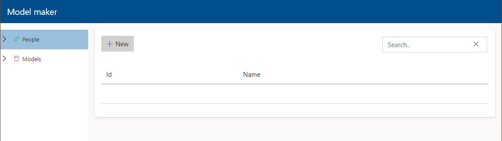

# Model Maker quick start

Let's imagine that you have the following model, and you want to generate a simple CMS for it:

```
Person:
  Name
  Email
  Bio
```

When [starting the project with the Model Maker plugin installed](SETUP_MMSERVERSIDE.md), you are
greeted with the following interface:


Since we know what model we want to create, we can go ahead and use the Models collection to add a new
model. What the `Output` means will be covered further down.


After saving, the posibilty of adding properties becomes available. The Model Maker always adds an Id
property to every model, which is of the type `Int32`. Adding the Name property will require something
like this:


By checking `Use as entity title` the Name property will used as title for the model, which means that in
trees and dropdowns this property is used to display the entity. It will also be the first property in a 
list view.

After adding the two other properties, the model will look like this:


When inspecting the Dependencies > Analyzers nodes in the solution explorer we see that the source generator
is not generating any files yet:


This is because the JSON which contains the model configuration is not picked up by the compiler yet. Models
created by Model Maker are saved as JSON in the `RapidModels` by default. (This folder can be customized using the
`Advanced` options in the `AddModelMaker` method.) To have this JSON be picked up by the compiler, we have to
change it `C# compiler additional file`:


After that change, you should be able to see that 6 files are generated now:


You can click on those files to explore the code that has been generated, but you will find out that those
files contain code that looks very similar to what you would write when you create your own collections
[manually](QUICKSTART.md).

These generated files do not do anything yet, they have to be referenced in the `ConfigureServices` and `AddRapidCMSServer`
methods in `Startup.cs`:

```c#
services.AddScoped<BaseRepository<Person>, PersonRepository>();
services.AddTransient<PersonValidator>();

services.AddDbContext<ModelMakerDbContext>(
    builder => builder.UseSqlServer(Configuration.GetConnectionString("SqlConnectionString")),
    ServiceLifetime.Transient,
    ServiceLifetime.Transient);

services.AddRapidCMSServer(config =>
{
    config.AllowAnonymousUser();

    config.SetSiteName("Model maker");

    config.AddPersonCollection();

    config.AddModelMakerPlugin();
});
```

You must register the generated repository under its base class. This opens up the possibility to introduce your
own repository when you do not want to use the generated one. Furthermore, the entity validator must also be added
to the DI container. Validators have their own lifetime, and can also request additional services via their constructor.

Adding the collection to RapidCMS is easy, just call the generated extension method `AddPersonCollection()`.

Since Model Maker for now only supports EF Core, you should also register the generated DbContext and give it a
connection string. Run `Add-Migration` in the package manager console to create the initial migration, run `Update-Database` 
to update the database, and hit F5 to start your RapidCMS with the Person collection added:



The generated collection behaves identical to hand-crafted one, but this only took 2 minutes:


## Other collections

An isolated collection is hardly any fun, so let's add another collection and see how Model Maker allows us to
create relations. First, add a Role collection containing a single property Title and have Model Maker generate code
for it by setting its JSON as C# Compiler additional file:


Now go to the Person model and add the property Roles to it:


Add a new migration using EF Core tools, update your database and restart RapidCMS. The person model will look like this:


There are quite a few things to unpack here and it is important to understand how to configure relations. All types are supported
by the Model Maker EF Core generator, but some have some important details that should be taken into account.

### Many-to-many (without corresponding property)

This is the default relation that Model Maker picks. The Person-Role relation in this example is many-to-many, and a join table
is created (PersonRole) to facilitate this. Because there is no corresponding property on the Role model, the relation is not visible
on the Role model, and is considered a blind relation. 

### Many-to-many (with corresponding property)

When the Role model has a Linked Entities property configured that links to the Person model and they have been configured to be
corresponding properties, the relation between Persons and Roles can be configured from either side. If both sides do not have their
corresponding property configured, both Linked Entities properties are considered independent relations and two blind relations will
be created.

### One-to-many (without corresponding property)

When a model has a Linked Entity property configured, that becomes a one-to-many relation. The model will get a `{Model}Id` property.
If no corresponding property is configured, the relation is considered blind and can only be configured by the model with the Linked Entity.

### One-to-many (with corresponding property)

When a model has a Linked Entity property configured, and the related model has a Linked Entities property configured and the corresponding
properties are configured correctly, both properties will be referencing the same relation and that relation can be configured from
both ends. 

If both sides do not have their corresponding properties configured, both properties are considered to be independent relations and two blind
relations are created.

### One-to-one (where 1 side has a corresponding property configured)

When two models have a Linked Entity property configured to each other, and one of the two models have the corresponding property configured,
this will generate a one-to-one relation where the Depending Side of the one-to-one relation is set to the model that has the corresponding
property set. The Depending Side model will contain the `{Model}Id` property, the other side only has the navigational property.

### One-to-one (where both sides have a corresponding property configured)

When two models have a Linked Entity property configured to each other, and both sides have the corresponding property configured, the 
Depending Side will be determined by the name of the model. A one-to-one relation between Article and ArticleDetails will cause the ArticleDetails
to be the Depending Side since its name is after Article when ordering them.

If both sides do not have their corresponding properties configured, both properties are considered to be independent relations and two blind
relations are created.

## Developer cycle

When using Model Maker, the developer cycle will look something like this:

1. Open RapidCMS Model Maker.
2. Create new collection.
3. Change generated JSON to C# Compiler additional file.
4. Update Startup.cs
5. Run migrations.
6. Restart / hot reload RapidCMS to use new collection and fine tune its configuration.
7. Commit updated JSON to save configuration.

## Mixing collections

Since generated collections and hand-crafted ones are identical for RapidCMS, they can be mixed and matched. If you have created
a collection by hand, it is possible to create Entity Picker properties that depend on that collection. You can also reference
Model Maker collections in hand-crafted collections too.


## Custom properties, editors and property details

The default feature set of the Model Maker is probably enough for simple databases, but it is not a RapidCMS plugin if it cannot 
be completely customized. Customization is done by using the `AddModelMaker` extension method:

```c#
services.AddModelMaker(
    addDefaultPropertiesAndValidators: true,
    config =>
    {
        // add configuration
    });
```

If the default set of properties, editors and validations are not good enough, it is possible to remove those by setting `addDefaultPropertiesAndValidators`
to false. You will start with a clean, empty Model Maker.

### Customizing default properties, editors and property details

If you want to use the default set of features, but only slightly want to tweak them, it is possible to do so. Using the `config.GetProperty` or
`config.GetPropertyEditor` you can get a property or editor and adjust its features. You can add a custom editor to a default property so 
Short String can also use your awesome customer editor, or remove a property detail from a property because you don't want to be able to use it.

### Custom property

Adding a custom property is done by calling `AddProperty` and configuring it. This is how a specific Enum is added to the Model Maker:

```c#
config.AddProperty<ContentType>("contentType", "Content Type", "Tag", new string[] { }, new string[] { });
```

The two empty `string[]` allow you to add specific editors and details to a property. Not all editors make sense for certain property types,
so you can add the aliases of the ones that make sense. The default editors and details aliases are available in `RapidCMS.ModelMaker.Constants`.

### Custom editor

Adding a custom editor is done by calling `AddPropertyEditor` and configuring it. This is how a custom text area editor is added to the Model Maker:

```c#
config.AddPropertyEditor<CustomTextAreaEditor>("custom", "Very big text area");
```

### Custom property details

Property details are the things that make properties really work and these details are used to add logic and validation to otherwise
quite limited properties. A property detail hinges on a config object that stores the configuration and determines how a property should
behave. If we analyze the default MinLength property detail, it look like this:

```c#
config.AddPropertyDetail<MinLengthDetailConfig, int?>(
    Constants.PropertyDetails.MinLength,
    "Minimum length",
    "The value has to be at least this amount of characters.",
    EditorType.Numeric,
    x => x.Config.MinLength);
```

```c#
public class MinLengthDetailConfig : IDetailConfig
{
    [Range(1, int.MaxValue)]
    public int? MinLength { get; set; }

    public bool IsEnabled => MinLength.HasValue;
    public bool AlwaysIncluded => false;

    public bool IsApplicable(PropertyModel model)
        => model.EditorAlias.In(Constants.Editors.TextArea, Constants.Editors.TextBox);

    public string? RelatedCollectionAlias => default;

    public string? ValidationMethodName => "MinimumLength";

    public string? DataCollectionType => default;
}
```

The `AddPropertyDetail` configures how the detail looks when used in the Model Maker:


It references the object `MinLengthDetailConfig`. This object stores `MinLength` configured by the user. It exposes a
few properties that are important:

- `IsEnabled`: When set to `true`, this property detail is enabled and the source generator will include it.
- `AlwaysIncluded`: When set to `true`, this property detail is always included by the source generator.
- `IsApplicable`: Returns true when the property detail is applicable for the current `model`. Some details are not
useful when the property uses a certain editor or has another detail active.
- `ValidationMethodName`: The generated validators all use `FluentValidation`. This method name is one of the extension
methods from `FluentValidation`. If you make your own validator, you should make it a `FluentValidation` extension method
and create it in the `FluentValidation` namespace. See [FluentValidation documentation](https://docs.fluentvalidation.net/en/latest/custom-validators.html).
- `RelatedCollectionAlias` is applicable when the property is another entity, and this should contain the alias of that collection.
- `DataCollectionType` is applicable when the property is a picker of some sorts, and this contains the type of the `IDataCollection` for that property.

Adding a custom property detail is easy, this example shows how to create a validator that checks for block-listed words
which is added to the build-in Short and Long String property types.

```c#
var customTextValidator = config.AddPropertyDetail<BannedContentValidationConfig, List<string>>(
    "bannedContent",
    "Banned Content",
    "The content is not allowed contain the following words.",
    EditorType.ListEditor,
    property => property.Config.BannedWords);

config.GetProperty(Constants.Properties.ShortString)?.Details.Add(customTextValidator);
config.GetProperty(Constants.Properties.LongString)?.Details.Add(customTextValidator);
```

```c#
public class BannedContentValidationConfig : IDetailConfig
{
    public List<string> BannedWords { get; set; } = new List<string>();

    public bool IsEnabled => BannedWords.Any();

    public bool AlwaysIncluded => false;

    public bool IsApplicable(PropertyModel model)
        => model.EditorAlias.In(Constants.Editors.TextBox, Constants.Editors.TextArea);

    public string? RelatedCollectionAlias => default;

    public string? DataCollectionExpression => default;

    public string? ValidationMethodName => "BannedContent";

    public string? DataCollectionType => default;
}
```

```c#
public static class BannedContentValidator
{
    public static IRuleBuilderOptions<T, string> BannedContent<T>(this IRuleBuilder<T, string> ruleBuilder, BannedContentValidationConfig config)
    {
        return ruleBuilder
            .Must(value => !config.BannedWords.Any(value.Contains))
            // this error message will be quite offensive if all banned words are displayed like this
            .WithMessage($"The value may not contain these words: {string.Join(",", config.BannedWords)}.");
    }
}
```

## Generate less

By changing the what has been selected in the `Output` property, you can instruct the generator to generate less. If you want
to manually create repositories, you can deselect `Repository` in that property, and no repository will be created for that model.

## Deploy without Model Maker

Model Maker is a development tool which should not be available in production. This can be achieved in two ways:

- Run the Model Maker in a separate ASP.NET Core application that is only run by developers locally on their machine.
- Call `config.AddModelMakerPluginCore()` instead of `config.AddModelMakerPlugin()` when running on the production environment.