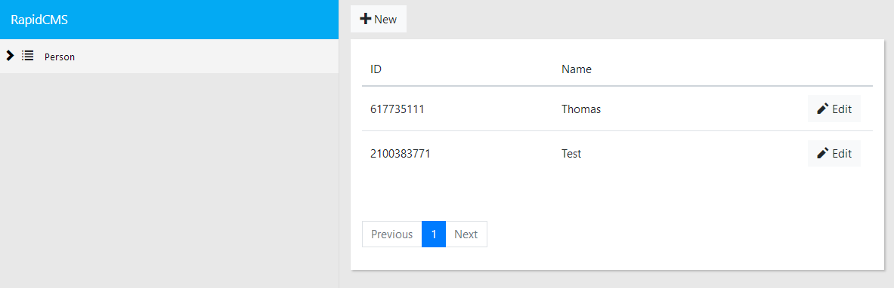
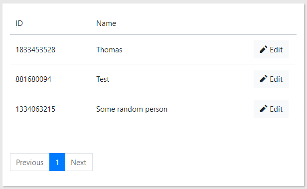

# RapidCMS

[](https://www.nuget.org/packages/RapidCMS.UI)

RapidCMS is a Blazor framework which allows you to build a responsive and flexible CMS
purely from code. It provides a basic set of editors and controls, next to allowing building your own blazor components
for every editor, button, pane, and dashboard section. If you provide the repositories for data and the configuration for
the UI, RapidCMS renders a complete CMS according to your specification.

Since RapidCMS runs as an element within your ASP.NET Core application, you have full control of the DI container, data repositories,
authentication, authorization, additional endpoints like Api controllers, Mvc controllers, and Razor pages. You can even
fully replace the default UI libary and only use the core of RapidCMS.

## TL:DR;

1. Create a new ASP.NET Core Blazor Server-App project.
2. Install NuGet-package: `RapidCMS.UI`.
3. Add `services.AddRapidCMS(config => { config.AllowAnonymousUser(); })` to `ConfigureServices` in `Startup.cs`.
4. Replace the `<Router>` in `App.razor` with `<RapidCMS.UI.Components.Router.RapidCmsRouter />`.
5. Replace the `<link href="css/site.css" rel="stylesheet" />` tags in `_Host.cshtml` with `<link href="_content/rapidcms.ui/css/site.css" rel="stylesheet" />` and remove any other css.
6. Hit `F5`: you're now running a completely empty RapidCMS instance. 
7. Start building your CMS using by expanding `config => {}`. Read the introduction below to get a sense of what is possible,
or browse the [Example Project](https://github.com/ThomasBleijendaal/RapidCMS/tree/master/docs/RapidCMS.Example) to see all the options.

## Screenshots

Since it is a bit hard to demonstrate a CMS on the internet without having the publicly accessible
CMS be absolutely vandalised, [on this page there are some screenshots of the features that are currently supported](SCREENSHOTS.md).

---

## Simple collection

Let's imagine that you have the following entity, and you want to build a simple CMS for it:

```c#
public class Person
{
    public int Id { get; set; }
    public string Name { get; set; }
    public string Email { get; set; }
    public string Bio { get; set; }
}
```

First, every entity must be derived from `IEntity`, which uses RapidCMS as base for every 
entity in the system, so the `Person` class is updated to something like this:

```c#
public class Person : IEntity
{
    public int Id { get; set; }
    public string Name { get; set; }
    public string Email { get; set; }
    public string Bio { get; set; }

    string IEntity.Id { get => Id.ToString(); set => Id = int.Parse(value); }
}
```

The `IEntity` interface expects an `Id` of type `string`, and by implementing it explicitly,
it does not interfere with the rest of the entity.

In order to start specifying how the UI for this entity, head to your `Startup.cs` and add
`using RapidCMS.Common.Extensions;` at the top of the file, and put the following code in the
`ConfigureServices` method.

```c#
services.AddScoped<InMemoryRepository<Person>>();
services.AddRapidCMS(config =>
{
    config.AllowAnonymousUser();

    config.AddCollection<Person>("person", "Person", collection =>
    {
        collection
            .SetTreeView(x => x.Name)
            .SetRepository<InMemoryRepository<Person>>()
            .SetListView(view =>
            {
                view.AddRow(row =>
                {
                    row.AddField(p => p.Id.ToString());
                    row.AddField(p => p.Name);
                });
            });
    });
});
```

Okay, lots of things happen here. First, include the `RapidCMS.Repositories` NuGet package
in your project, since that project contains the `InMemoryRepository` example repository which
we will use for now (you can also switch to `JsonRepository` if you want persistent storage). 
This respository also expects that the `Person` implements `ICloneable`, so let's go ahead and do that:

```c#
public class Person : IEntity, ICloneable
{
    public int Id { get; set; }
    public string Name { get; set; }
    public string Email { get; set; }
    public string Bio { get; set; }

    string IEntity.Id { get => Id.ToString(); set => Id = int.Parse(value); }

    public object Clone()
    {
        return new Person
        {
            Bio = Bio,
            Email = Email,
            Id = Id,
            Name = Name
        };
    }
}
```

After that change, the project should be able to build, and if we hit `F5` the following
UI should appear:


Okay, it's something, but a lot of stuff is still missing. But let's go over what the current code
is doing, and then continue on making the CMS work correctly.

### Repositories

In RapidCMS, you are responsible for implementing the data layer, and that's why the `InMemoryRepository` 
is added to the `IServiceCollection` as a seperate instruction:

```c#
services.AddScoped<InMemoryRepository<Person>>();
```

There is no abstraction magic, or default repository implementation, so you need to create your own
repositories which implement `IRepository` (or one of the derived abstract classes).

#### Entity Framework Core Repositories

Be aware that EF Core based repositories must be added with an `Transient` lifetime scope, as well as
the corresponding `DbContext`. Due to the current UI setup, multiple queries towards the same `DbContext` 
can be fired simultaniously from multiple threads, which will result in DbContext threading issues. By 
setting the lifetime scope to `Transient`, every user of these repositories will have their own instance, 
fixing the multiple threads issue. 

### Authorization

Just as repositories, authorization in RapidCMS must be configured by including the correct
`AuthorizationHandler`s in the `IServiceCollection`. To make your live easier when starting developing
with RapidCMS, `config.AllowAnonymousUser();` adds a very permissive `AthorizationHandler` to the service
collection, and allows everybody to do anything.

The `AuthorizationHandler` is part of the [ASP.NET Core Authorization Infrastructure](https://docs.microsoft.com/en-us/aspnet/core/security/authorization/resourcebased?view=aspnetcore-2.2).

### Authentication

There is no standard authentication support out of the box, so you have to do everything to have your
uses sign in. But there are already some great resources [for adding Azure AD support to blazor](https://devblogs.microsoft.com/aspnet/configuring-a-server-side-blazor-app-with-azure-app-configuration/),
so it's easy to get it working. See [this page about adding authentication](AUTH.md) for more information.

### Collections

A core concept in RapidCMS is the collection. This is an container which holds a list entities and contains
all the configuration for the different UIs the CMS supports. In this example, a simple list view is
configured, display the `Id` and `Name`.

### Tree

The tree is used for navigating around in RapidCMS, and collections which have a set `TreeView`, will become
visible in the tree. For this example, the `Name` property of `Person` is used to display in the tree. Any
valid expression which returns a string will be valid to be used in the tree.

### Interactions

As you can see, the UI is missing a lot of buttons. A paginator is present, but there is no way of creating,
updating or deleting any `Person`. That is because RapidCMS does not assume what buttons should be displayed. You
have to specifiy them yourself.

So let's add some buttons, and get this CMS fully working:

```c#
config.AddCollection<Person>("person", "Person", collection =>
{
    collection
        .SetTreeView(x => x.Name)
        .SetRepository<InMemoryRepository<Person>>()
        .SetListView(view =>
        {
            view.AddDefaultButton(DefaultButtonType.New);

            view.AddRow(row =>
            {
                row.AddField(p => p.Id.ToString()).SetName("ID");
                row.AddField(p => p.Name);

                row.AddDefaultButton(DefaultButtonType.Edit);
            });
        })
        .SetNodeEditor(editor =>
        {
            editor.AddDefaultButton(DefaultButtonType.SaveExisting, isPrimary: true);
            editor.AddDefaultButton(DefaultButtonType.SaveNew, isPrimary: true);

            editor.AddDefaultButton(DefaultButtonType.Delete);

            editor.AddSection(section =>
            {
                section.AddField(x => x.Id).SetType(EditorType.Readonly);
                section.AddField(x => x.Name);
                section.AddField(x => x.Email);
            });

            editor.AddSection(section =>
            {
                section.AddField(x => x.Bio).SetType(EditorType.TextArea);
            });
        });
});
```

Much better:



As you can see, I have taken the liberty to add a `NodeEditor`, so you there is a proper
editor set up for editing an entity:


### Buttons

The default buttons in RapidCMS will provide the bulk of the operations you will need when
creating UIs, but there is some behaviour to take into account. Let's review what default buttons
are available, and what they do.

#### New

Clicking this button will direct the user to an empty editor so a new entity can be created. This button
can be placed on a `ListView` or a `ListEditor`.

#### SaveNew, SaveExisting

These buttons will trigger saving an entity, either inserting or updating the entity in the database.
These are seperate, so it's possible to have a different text on the insert button than the update button,
or to dissallow updating existing entities, but still allow the user to create new ones.

#### Delete

Clicking this button will delete the entity it is bound to, and can be used on any view.

#### Edit

This button will take the user to the editor for the entity it is bound to, so the user can edit the entity.

#### View

This button is similair to Edito, but will take the user to the `NodeView`, where the user cannot edit
the entity.

#### Add, Remove, Pick, Return

These buttons are for handling many-to-many relations in more advanced scenarios, and will be discussed later on.

### Views and Editors

In RapidCMS there are 4 types of UI, `ListView` and `ListEditor`, and `NodeView` and `NodeEditor`. These are
the primary screens which can be used to create your own CMS with. 

#### ListView



#### ListEditor


#### NodeView


#### NodeEditor


---

## Collections + sub collections

Collections are the building blocks with which you build your CMS. They allow you to build the main navigation
tree, and since it is a tree, it is possible to nest collections. Every collection can be seen as a root for another
set of collections underneath it:

```c#
config.AddCollection<Entity>("some-collection", "Some Collection", collection => {
    // [..]

    collection.AddCollection<SubEntity>("some-sub-collection", "Sub Collection", subCollection => {
        // [..]

        // you can add another layer here
    });
});
```

If a `SubEntity` is being edited in the example from above, the `id` of its corresponding parent entity is given as `parent` 
to each of the methods of the repository. This allows you to make more specific queries to the database, and simplyfies the logic
inside the repository.

If you have a collection that is recursive (for example folders which can contain folders, which can contain folders, etc), you
can specify that it is an recursive collection:

```c#
config.AddCollection<Entity>("some-collection", "Some Collection", collection => {
    // [..]

    collection.AddSelfAsRecursiveCollection();
});
```

This allows for infinite nesting of `Entities`.

The tree view follows the collection configuration, allowing the user to traverse the tree by folding open collection and reveiling
entities underneath each collection and sub collection.

There is no restriction to how many collection you want to add, or which repositories they use. Its totally possible to add multiple
collection which all use the same repository. Only the `collectionAlias` of each collection must be unique.

## ListView features


A `ListView` is a table, by which you can specify what the columns of the table should be, what buttons should be usable at the
top of the table, and at each row. Furthermore, it is possible to specify whether the search bar should be visible, and what kind of
data views should be used. 

## ListEditor features


A `ListEditor` is quite similar to a `ListView`, but in the list editor each column of the table is a form field, so its easy to
edit multiple entities at once.

## NodeEditor / NodeView features


A `NodeEditor` is a page which displays a form for editing a entity. A node editor can consist of mulitple sections, so you can
logically group related entities, or have specific specialisations for various entity subtypes. Using `.VisibleWhen` on sections or
editors, it's possible to show or hide editors or sections based what the user inputs.


A `NodeView` is similar to its editor counterpart, but in the view everything is readonly and cannot be edited.

### Embedding a list in a node

To allow for easy editing and navigating, it is possible to incorporate a `ListView` or `ListEditor` in a node editor. A `NodeEditor` 
will always display a `ListEditor`, and a `NodeView` will always display a `ListView`. Using the following code allows you to add
a list in a node:

```c#
    // [..]
    .SetNodeEditor(editor => {
        editor.AddSection(section => {
            section.AddSubCollectionListEditor<SubEntity>("sub-collection");
        });
    });
    // [..]
```

Using the `collectionAlias`, you can specify which collection must be used (in this case, `"sub-collection"`). You must also specify
what kind of entity the sub collection uses. The configuration of the `ListEditor` of the sub collection, which you specified when you 
defined the collection, is to render the list. 

## Relations

### One-to-many

RapidCMS support one-to-many and many-to-many relations between collections, although it requires somewhat more configuration. Let's assume
the database entities are as follows:

```c#
public class Person : IEntity
{
    public int Id { get; set; }
    public string Name { get; set; }
    public string Email { get; set; }
    public string Bio { get; set; }

    string IEntity.Id { get => Id.ToString(); set => Id = int.Parse(value); }

    public Country Country { get; set; }
    public int? CountryId { get; set; }
}

public class Country : IEntity
{
    public int Id { get; set; }
    public string Name { get; set; }
    
    string IEntity.Id { get => Id.ToString(); set => Id = int.Parse(value); }

    public ICollection<PersonCountry> Persons { get; set; }
}
```

In RapidCMS it is possible to create a dropdown which contains all the entities from a specific collection, and have the
user pick one of the entities. When this entity is saved, the id the picked entity is saved in the property which backed the
dropdown. For example:

```c#
editor.AddField(f => f.CountryId)
    .SetType(EditorType.Select)
    .SetCollectionRelation<CountryEntity>("country-collection", relation =>
    {
        relation
            .SetElementIdProperty(x => x.Id)
            .SetElementDisplayProperties(x => x.Name, x => x.Description);

    });
```

The `CountryId` property in this example is the property which contains the id of the related country. The `"country-collection"` collection
is referenced as source of entities from which can be picked. Using `.SetElementIdProperty` you can specify which property must
be used as `id`, and which gets stored in `CountryId`. `.SetElementDisplayProperties` allows you to specify multiple properties 
which are used in the UI, so the user can clearly make their choice. 

There are several additional methods available for controlling how the related collection fetches its data. By using `SetEntityAsParent` or
`SetRepositoryParent`, you can control what the repository of the related collection uses as parent. The `PersonCollection` in the `RapidCMS.Example`
project demonstrates how this works.


#### DataCollection

Instead of using `SetCollectionRelation` it's also possible to use `SetDataCollection`, and pass in a `IDataCollection`. This allows
you to add dropdowns or select boxes with data coming from a `IDataCollection`. This data collection can get its data from any source,
and the build-in `EnumDataProvider` uses a `Enum` to generate a list of options:

```c#
 pane.AddField(f => f.State)
    .SetType(EditorType.Dropdown)
    .SetDataCollection<EnumDataProvider<StateEnum>>();
```

### Many-to-many

Let's assume the entities look as follows for the many-to-many example:

```c#
public class Person : IEntity
{
    public int Id { get; set; }
    public string Name { get; set; }
    public string Email { get; set; }
    public string Bio { get; set; }

    string IEntity.Id { get => Id.ToString(); set => Id = int.Parse(value); }

    public ICollection<PersonCountry> Countries { get; set; }
}

public class PersonCountry
{
    public int? CountryId { get; set; }
    public Country Country { get; set; }

    public int? PersonId { get; set; }
    public Person Person { get; set; }
}

public class Country : IEntity
{
    public int Id { get; set; }
    public string Name { get; set; }
    
    string IEntity.Id { get => Id.ToString(); set => Id = int.Parse(value); }

    public ICollection<PersonCountry> Persons { get; set; }
}
```

There are two stategies for supporting many-to-many relations in RapidCMS. One is via a somewhat more complex editor, and one is
via a dedicated sub collection editor. Both methods are fine, but have some implications on how the relation is saved.

#### Sub collection editor

The sub collection editor is by far the more easy option for supporting many-to-many relations, and can be added to a `NodeEditor`
via the following code:

```c#
editor.AddSection(pane =>
{
    pane.AddRelatedCollectionListEditor<CountryEntity>("related-country-collection");
});
```

Just as `AddSubCollectionListView`, the configuration for this list is fetched from the `"related-country-collection"` collection. Next
to that, you are also required to implement `GetAllRelatedAsync`, `GetAllNonRelatedAsync`, `AddAsync`, and `RemoveAsync` methods on
the _related_ repository, so in this case it is the repository of `"related-country-collection"`. Further more, the related collection
must have a `ListView` _and_ a `ListEditor`, by which the list view is used for picking entities, and the list editor for listing the
related entities. Do not forget to add a `DefaultButtonType.Pick` button on each row in the `ListView`, a `DefaultButtonType.Add` on the
`ListEditor`, and a `DefaultButtonType.Remove` on each row in the `ListEditor`, to support adding and picking unrelated entities and removing
related entities.

The related collection editor is just another list editor, so it's possible to edit the related entities from the node editor which
implemented the related collection editor. And if that is not allowed, use readonly editors, or use the Editor variant for the many-to-many
relation.

#### Editor

The editor variant of the many-to-many relation is somewhat more tricky. To add such an editor to a `NodeEditor`, use the following
code:

```c#
editor.AddEditor(editor =>
{
    editor.AddField(f => f.Countries)
        .SetName("Countries")
        .SetType(EditorType.MultiSelect)
        .SetCollectionRelation<CountryEntity, int?>(
            countries => countries.Select(x => x.CountryId),
            "country-collection", 
            relation =>
            {
                relation
                    .SetElementIdProperty(x => x.Id)
                    .SetElementDisplayProperties(x => x.Name, x => x.Description);
            });
});
```

This adds a `MultiSelect` editor to the `NodeEditor`, which is like multi-line dropdown, but with a better UX. It is bound to the `Countries` 
property on `Person`. This allows you to add validation attributes derived from `RelationValidationAttribute` to this property to validate it.

`SetCollectionRelation` is must be set for this editor, just as in the one-to-many case. This method has three arguments, the first one is another 
expression for getting the ids of the related elements, so the editor knows which elements are selected. The next argument accepts an alias for
the collection which provides the related entities, in this case the country collection. The third argument is a lambda which allows you to specify
how the related elements should be displayed in the editor. 

In contrast to the one-to-many case, the backing field is an expression which only gets a value, but does not allow to set the value.
In order to make it possible to save which entities are selected, the `IRelationContainer` in the `InsertAsync` or `UpdateAsync` methods on
the `IRepository` contain the selected entities. An example of how this container can be used can be seen in the following code:

```c#
public class PersonRepository
{
    // [..]

    public override async Task UpdateAsync(int id, IParent? parent, PersonEntity entity, IRelationContainer? relations)
    {
        // this example uses ef core
        var dbEntity = await _dbContext.Persons.Include(x => x.Countries).FirstOrDefaultAsync(x => x.Id == id);

        // get the related entities from the editor by using the type of the related entites, and the type of its id
        var newCountries = relations.GetRelatedElementIdsFor<CountryEntity, int>();

        // check if existed on the editor
        if (newCountries != null) 
        {
            // remove entities which were related, but deselected by the user
            foreach (var country in dbEntity.Countries.Where(x => !newCountries.Contains(x.CountryId.Value)).ToList())
            {
                dbEntity.Countries.Remove(country);
            }

            // add entities which are now selected
            foreach (var countryId in newCountries.Where(id => !dbEntity.Countries.Select(x => x.CountryId.Value).Contains(id)).ToList())
            {
                dbEntity.Countries.Add(new PersonCountryEntity { CountryId = countryId });
            }
        }

        _dbContext.Persons.Update(dbEntity);
        await _dbContext.SaveChangesAsync();
    }

    // [..]
}
```

## Data views

You can add data views to a collection, which results in tabs at the top of the list view and editor, and allow you to
create multiple views to your collection, so the user can find an entity more easily. You add them by calling `.AddDataView` on
your collection:

```
collection
    .AddDataView("All", x => true)
    .AddDataView("Even IDs", x => x.Id % 2 == 0)
    .AddDataView("Uneven IDs", x => x.Id % 2 == 1)
```

The query expression of the selected data view is given to your `IRepository` in the `IQuery<T>` parameter of the `GetAllAsync` method
(and `GetAllRelatedAsync` and `GetAllNonRelatedAsync` as well).

## Search

Just as data views, the users search term is passed into your `IRepository` via the `IQuery<T>` parameter of the `GetAllAsync` method.
The `SearchTerm` is a nullable string, so first check whether the users is searching for something, and then implement your own search
algorithm. 

## Implementing a repository

TODO: documentation

TL;DR:

1. Create a class and have it inherit `BaseRepository<TKey, TEntity>` and jump through all the hoops (implement all abstract methods).
2. Attach it to a collection using `collection.SetRepository<YourRepo>()`.

When you want to support Relations, override these four virtual methods: `GetAllRelatedAsync`, `GetAllNonRelatedAsync`, `AddAsync`, and `RemoveAsync`.

### Some best practices (not exhaustive)

- *Always* return entities from entity framework DbSet with `.AsNoTracking()`.
- *Always* support all the features from `IQuery<T>`; that is supporting `Skip` and `Take` for paginating, calling `MoreDataAvailable` and pass in
a `true` when there is more, and a `false` when there is not. Furthermore, support searching by checking `SearchTerm` and always use the `DataViewExpression` 
when it is set.
- Use `IMessageService` to send messages to the user when an entity has been saved etc.

## Creating custom editors

TODO: documentation

TL;DR:

1. Create a custom editor and have it `@inherit BaseEditor`.
2. Have a field use your editor by calling `editor.AddField(x => x.Prop).SetType(typeof(YourCustomEditor))`.

## Creating custom buttons

TODO: documentation 

TL;DR:

1. Create a custom button an have it `@inherit BaseButton`.
2. Have an editor use your button by calling `editor.AddCustomButton<YourCustomActionHandler>(typeof(YourCustomButton))` 
and create a `YourCustomActionHandler` which implements `IButtonActionHandler`.

## Creating custom modals

TODO: documentation

TL;DR:

1. Create a custom pane and have it `@inherit BaseSidePane`, this base class gives you access to `EditContext` that allows you
    to modify the Entity.
2. Add any type of custom logic on your pane, and even `@inject` extra services 
2. Have your custom pane call `ButtonClicked` when the user clicks a button on your pane.
3. Have an editor invoke your pane by calling `list.AddPaneButton(typeof(YourCustomPane), "Button text", "icon", CrudType.DEFAULTCRUDTYPE)`.

## Creating custom sections

TODO: documentation

TL;DR:

1. Create a custom section and have it `@inherit BaseSection` (or `@inherit BaseEditContextSection` if you want access to `EditContext`).
2. Have a view or editor use your section by calling `list.AddRow(typeof(YourCustomSection))` or `editor.AddSection(typeof(YourCustomSection))`.
