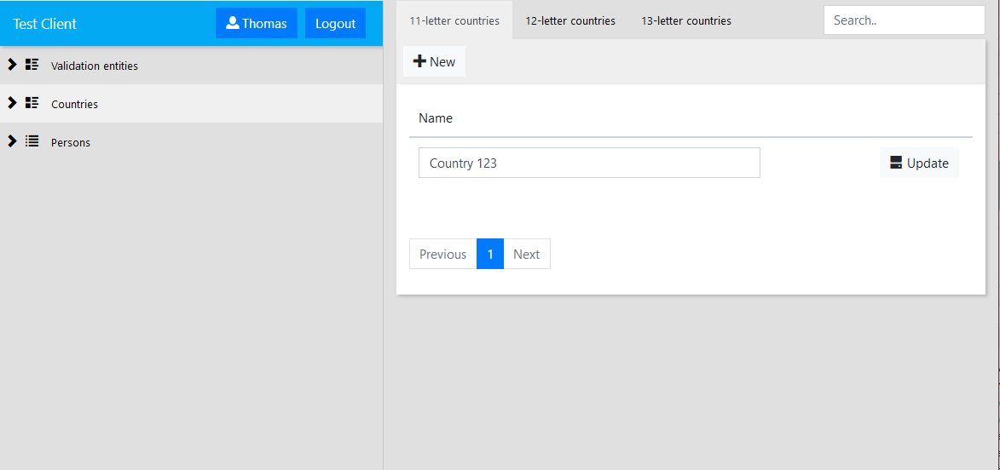

# Screenshots

## Home screen

Customisable dashboard with either custom components, or configured list views.

## Tree + node editor

Multi-level tree for easy navigation.

Node editor with a single Textbox editor, and a many-to-many relation with configurable
data views (the All and Countries with 1234 tabs), and easy editing of related entity.

Easy entity picking to relate entities to other entities.

## Recursive collection nesting + validation

Easy collection nesting (even recursive).

Out of the box validation support via validation attributes, on all editors.

## Bring your own authentication + dynamic data views

Totally configurable authentication (since nothing is provided out of the box), so it's 
possible to have authentication based on Identity, or use something like Azure AD.

Data views can be generated dynamically, so next to having fixed, hard-coded data views, 
generate the required tabs using a `DataViewBuilder`.